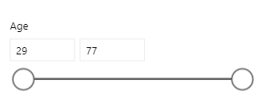
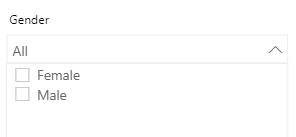
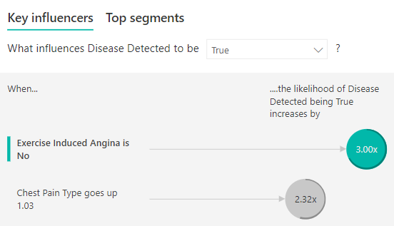
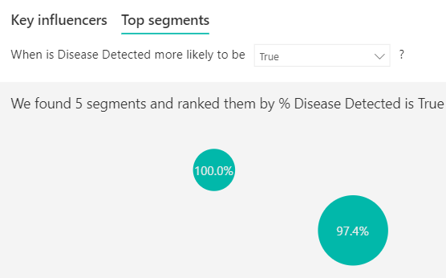
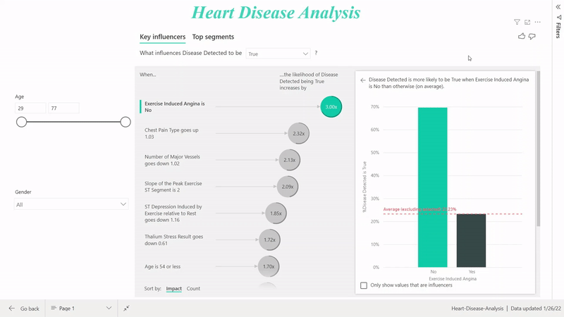

# ❤️ Heart Disease Analysis — Power BI

> Part of the [DocInsights](../) project — a use case showing DocInsights' extraction pipeline feeding a downstream analytics dashboard.


## How this connects to DocInsights

[DocInsights](../) is a multi-document intelligence pipeline (RAG + ChromaDB) built to extract and structure information from raw source documents. This folder is a practical showcase of that pipeline: DocInsights was used to parse and structure the raw UCI Heart Disease dataset, and the cleaned output was then loaded into Power BI to build the interactive dashboard below. In short — DocInsights handles the *extraction and structuring*, Power BI handles the *visualization and insight discovery*.

---

## 📌 Overview

Cardiovascular diseases (CVDs) are the leading cause of death globally, claiming an estimated **17.9 million lives every year** (WHO). This dashboard analyzes patient diagnostic data to identify which clinical factors most strongly influence a heart disease diagnosis, giving medical professionals a faster way to read patient data and prioritize treatment.

**Demo Video:** [Watch here](https://youtu.be/QpFf__Gq4xQ)

## 🩺 Problem Statement

Modern healthcare systems generate a huge volume of data from wearables, smart devices, and handheld monitors, making it hard for medical professionals to make sense of it quickly. Poor data visualization is one of the biggest bottlenecks in healthcare analytics — reading raw numerical data is slow and prone to misinterpretation.

## 💡 Solution

Power BI turns that complex, convoluted patient data into clear, interactive visuals — with DocInsights handling the upstream extraction and structuring, so the dataset feeding into the dashboard is already clean and query-ready.

---

## 🔗 Pipeline — how this was actually built

This isn't just a static export — the [`pipeline/`](pipeline/) folder contains the real script that wires DocInsights' own ingestion code to this dataset:

1. **Ingest** — `pipeline/extract_and_clean.py` calls DocInsights' `src/document_parser.py:parse_document()`, the exact function `app.py` calls when you upload a file in the Streamlit UI. This chunks `Heart_disease.csv` the same way DocInsights chunks any uploaded document, ready for embedding into ChromaDB via `src/vector_store.py`.
2. **Structure** — the script renames the raw UCI column codes (`cp`, `exang`, `ca`, `thal`, …) into the readable labels used throughout this README and the dashboard, and writes the result to `pipeline/output/Heart_disease_cleaned.csv` — this is the file that was loaded into `Heart-Disease-Analysis.pbix`.
3. **Validate** — the script also computes a lightweight, transparent sanity-check of the same factors Power BI's Key Influencers visual surfaces, and writes them to `pipeline/output/key_findings.md`.

**Run it yourself:**
```bash
python heart-disease-powerbi/pipeline/extract_and_clean.py
```

> **Note on the numbers:** the multipliers in `pipeline/output/key_findings.md` are simple univariate likelihood ratios computed directly from the cleaned data — a quick, reproducible sanity check. The **3.00x / 2.32x / 2.13x / 2.09x** figures in the Key Findings table below come from Power BI's Key Influencers visual, which runs a multivariate stepwise regression controlling for the other clinical factors simultaneously — that's why the two sets of numbers differ, and the Power BI figures are the ones driving the dashboard.

---

## 📊 Dashboard Features

The report has **two interactive tabs** and **two slicers**, letting users filter results by age range and gender in real time.

### Slicers
<p float="left">
  
  
</p>

### Tab 1 — Key Influencers
Surfaces the individual factors most strongly correlated with a positive heart disease diagnosis, ranked by impact.



### Tab 2 — Top Segments
Groups patients into segments and ranks them by likelihood of a positive diagnosis.



### Full Report Walkthrough


---

## 🔍 Key Findings

- **Female patients** were more likely to have heart disease overall.
- The disease is most common in patients aged **29–54**.

| Factor | Prevalence | Impact on Likelihood |
|---|---|---|
| Exercise-Induced Angina = No | 69.61% of patients | **3.00x** more likely |
| Chest Pain Type = 1 | 89% of patients | **2.32x** more likely |
| Number of Major Vessels = 0 | 74.29% of patients | **2.13x** more likely |
| Slope of Peak Exercise ST Segment = 2 | 75.35% of patients | **2.09x** more likely |

---

## 📁 Dataset

- **Source:** [UCI Heart Disease Dataset](https://drive.google.com/drive/folders/1M5z7z1NmWar7y1eFs67orfjqHL0iSViL) (via iNeuron)
- **Feature explanations:** [Kaggle guide](https://www.kaggle.com/onatto/predicting-heart-disease-a-detailed-guide)
- 13 clinical attributes used to predict the target variable (heart disease: Yes/No)
- Column names were renamed during transformation for clarity

## 🚀 Getting Started

1. Open `Heart-Disease-Analysis.pbix` in [Power BI Desktop](https://powerbi.microsoft.com/desktop/)
2. Use the **Age** and **Gender** slicers to filter the data
3. Toggle between the **Key Influencers** and **Top Segments** tabs to explore what drives diagnosis

## 🙏 Credits

- Dataset: UCI Machine Learning Repository, via iNeuron
- Feature explanations: [Kaggle — onatto](https://www.kaggle.com/onatto/predicting-heart-disease-a-detailed-guide)
- Vector art: People vector created by katemangostar — [freepik.com](https://www.freepik.com/vectors/people)

## 📂 Folder Structure

```
heart-disease-powerbi/
├── README.md
├── Heart-Disease-Analysis.pbix
├── Heart_disease.csv               # raw source data
├── pipeline/
│   ├── extract_and_clean.py        # runs DocInsights' own parser on the CSV, then structures it
│   └── output/
│       ├── Heart_disease_cleaned.csv   # structured file loaded into Power BI
│       ├── key_findings.json
│       └── key_findings.md
└── assets/
    ├── Age-Slicer.png
    ├── Gender-Slicer.png
    ├── Key-Influencers.png
    ├── Top-Segments.png
    ├── Overall-visual.gif
    └── Doctors-Vector-Art.jpg
```
